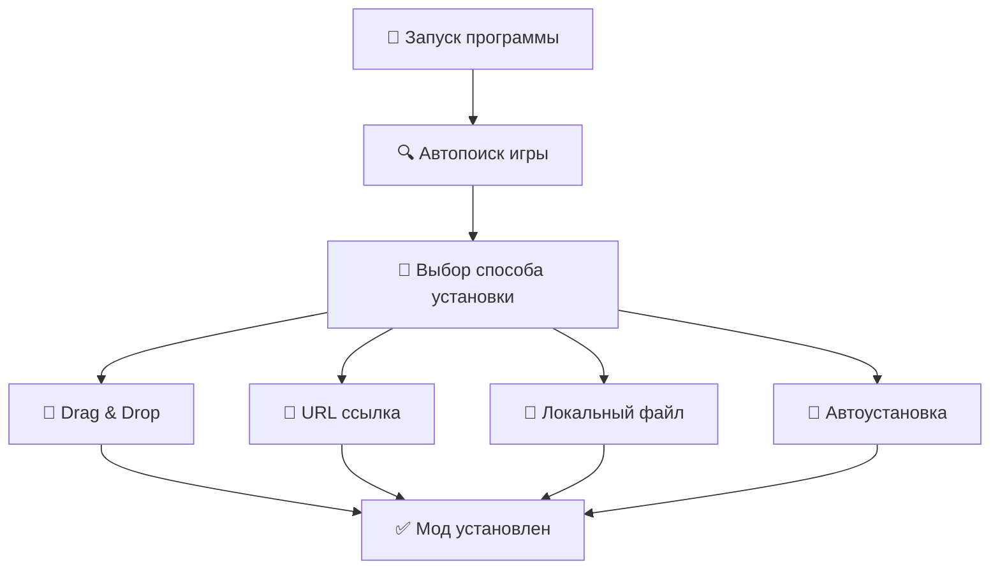

# 🎮 Sims 4 Auto Mod Installer

<div align="center">


**Автоматический установщик модов для The Sims 4 с обновлениями через GitHub**

[📥 Скачать .exe](https://github.com/neirrio/sims4-mod-installer/releases/latest) • [📖 Документация](#-документация) • [🐛 Сообщить о проблеме](https://github.com/neirrio/sims4-mod-installer/issues)

</div>

---

## ✨ Возможности

### 📦 Установка модов
- 🎯 **Настоящий drag-and-drop** - перетаскивайте файлы прямо в программу
- 📁 **Поддержка всех форматов** - .package, .ts4script, .zip, .7z, .rar, .exe
- 🔗 **URL установка** - скачивайте модов по прямым ссылкам
- 🤖 **Автоустановка** - список URL для автоматической установки

### 🔄 Автоматические обновления
- 🌐 **Проверка через GitHub** - автоматическая проверка новых версий
- ⚡ **Бесшовная установка** - скачивание и установка без участия пользователя
- 🔒 **Обязательные обновления** - критические обновления устанавливаются принудительно
- 🔧 **Режим обслуживания** - удаленное отключение программы при работах

### 🎯 Умная обработка
- 🧠 **Автоопределение форматов** - программа распознает тип файла
- 📤 **Извлечение нужных файлов** - только .package и .ts4script из архивов
- 📦 **SFX архивы** - автоматическая распаковка самоизвлекающихся архивов
- 🔄 **Конфликты файлов** - автоматическое переименование дубликатов

### 🎨 Интерфейс
- 🎭 **Современный дизайн** - интуитивный и понятный интерфейс
- 📊 **Визуальная обратная связь** - индикаторы прогресса и статуса
- ⚙️ **Настройки** - кастомизация под ваши нужды
- 📝 **Лог операций** - подробная информация о всех действиях

---

## � Быстрый старт

### 📥 Готовая версия (рекомендуется)

<details>
<summary>🖱️ Нажмите для подробных инструкций</summary>

1. 🌐 Перейдите в [Releases](https://github.com/neirrio/sims4-mod-installer/releases)
2. 📥 Скачайте `Sims4-Mod-Installer.exe`
3. 🎮 Запустите программу
4. ✨ Наслаждайтесь автоматической установкой модов!

</details>

### 👨‍💻 Для разработчиков

<details>
<summary>💻 Инструкции для разработки</summary>

```bash
# Клонирование репозитория
git clone https://github.com/neirrio/sims4-mod-installer.git
cd sims4-mod-installer

# Установка зависимостей
pip install -r requirements.txt

# Запуск программы
python sims4_mod_installer.py
```

</details>

---

## 🎮 Как использовать

<div align="center">



</div>

### 📋 Пошаговая инструкция

1. 🎮 **Запустите программу** - она автоматически найдет игру
2. 📁 **Выберите способ установки:**
   - 🎯 Перетащите файлы модов в программу (drag-and-drop)
   - 🔗 Вставьте URL для скачивания
   - 📂 Выберите локальный файл
   - 🤖 Используйте автоустановку из списка
3. ✨ **Следуйте инструкциям** - программа всё сделает автоматически

---

## 📁 Поддерживаемые форматы

| Формат | Описание | Поддержка |
|--------|----------|-----------|
| 📦 `.package` | Основные файлы модов | ✅ Полная |
| 📜 `.ts4script` | Скриптовые моды | ✅ Полная |
| 🗜️ `.zip` | ZIP архивы | ✅ Полная |
| 📦 `.7z` | 7-Zip архивы | ✅ Полная |
| 🗜️ `.rar` | RAR архивы | ✅ Полная |
| ⚙️ `.exe` | Инсталляторы и SFX архивы | ✅ Полная |

---

## 🛠️ Системные требования

| Требование | Минимальная | Рекомендуемая |
|-------------|-------------|---------------|
| 💻 ОС | Windows 7 | Windows 10/11 |
| 🐍 Python | 3.6+ | 3.9+ |
| 💾 RAM | 2 ГБ | 4 ГБ |
| 💾 Диск | 100 МБ | 500 МБ |

---

## 📖 Документация

### 📚 Руководства
- [🚀 Быстрый старт](#-быстрый-старт)
- [⚙️ Расширенные настройки](docs/advanced.md)
- [🐛 Устранение проблем](docs/troubleshooting.md)

### 🔧 API
- [📡 GitHub API](docs/api.md)
- [🔄 Система обновлений](docs/updates.md)

---

## 🤝 Вклад в проект

Мы ценим любой вклад! Вот как вы можете помочь:

### 🐛 Сообщить о проблеме
- Используйте [Issues](https://github.com/neirrio/sims4-mod-installer/issues)
- Опишите проблему подробно
- Приложите скриншоты при необходимости

### 💡 Предложить улучшение
- Создайте [Discussion](https://github.com/neirrio/sims4-mod-installer/discussions)
- Опишите вашу идею
- Обсудите реализацию

### 🔨 Внести код
1. Форкните репозиторий
2. Создайте ветку (`git checkout -b feature/AmazingFeature`)
3. Внесите изменения (`git commit -m 'Add some AmazingFeature'`)
4. Отправьте (`git push origin feature/AmazingFeature`)
5. Создайте Pull Request

---

## 📊 Статистика проекта

<div align="center">


</div>

---

## 📄 Лицензия

Этот проект лицензирован под MIT License - см. файл [LICENSE](LICENSE) для подробностей.

---

## 🙏 Благодарности

- **The Sims 4 Community** за вдохновение и поддержку
- **GitHub** за хостинг и CI/CD
- **Python** за прекрасный язык программирования
- **Всем участникам** за вклад в проект

---

## 📞 Контакты

<div align="center">

**Автор:** [neirrio](https://github.com/neirrio)  
**Проект:** [Sims 4 Auto Mod Installer](https://github.com/neirrio/sims4-mod-installer)  
**Email:** neirrio@github.com

[🔝 Наверх](#-sims-4-auto-mod-installer)

</div>

---

<div align="center">

**⭐ Если этот проект помог вам, поставьте звезду!**

</div>


